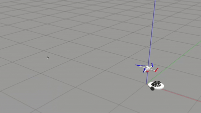
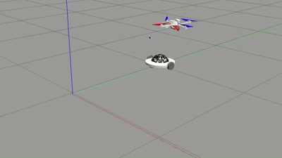

# Square Cupola AprilTag: A High-Precision Fiducial Marker

This repository contains the research outcomes for "Square Cupola AprilTag: A High-Precision Fiducial Marker for Pose Estimation Based on Accuracy Experiments of AprilTag".

## Overview

This research addresses the limitations of standard fiducial markers in precise pose estimation for Unmanned Aerial Vehicles (UAVs), particularly their restricted detection angles and suboptimal accuracy. To overcome these issues, we propose the **Square Cupola AprilTag**, a novel three-dimensional fiducial marker. Its unique structure enables detection over a broader range of angles. The core contribution is a data fusion algorithm, based on empirical accuracy experiments of the standard AprilTag, to optimally fuse pose estimations from multiple faces of the cupola. This method significantly reduces pose errors and demonstrates enhanced robustness, especially in challenging reflective environments.

## Key Results

### Improved Pose Estimation Accuracy

Compared to the standard AprilTag, our Square Cupola AprilTag, combined with the proposed data fusion algorithm, demonstrates a significant reduction in pose estimation error and variance, especially at larger distances. 

As shown in the figures below, the position error in the z-axis is reduced significantly (by up to four times at a distance of 3.4 m), and the orientation estimation is much more stable with minimal fluctuation.

*Position error (z-axis) and standard deviation for different z distances.*

*Orientation accuracy (rx error) of the standard AprilTag and the square cupola AprilTag.*

### UAV Target Tracking Performance

We validated the effectiveness of our method in simulated UAV target tracking scenarios. The UAV successfully tracks a ground vehicle moving in both uniform linear and circular motions, relying solely on visual feedback from the Square Cupola AprilTag without external systems like GPS.

**1. Uniform Linear Motion Tracking**

The UAV tracks a ground vehicle moving at a constant velocity of 0.7 m/s. The UAV successfully accelerates, matches the target velocity, and achieves stable tracking with a position error in x stabilizing at approximately 0.07 m.

*Simulation of UAV tracking a vehicle in uniform linear motion.*

*Tracking error of uniform linear motion.*

**2. Uniform Circular Motion Tracking**

The UAV tracks a ground vehicle moving along a circular trajectory with a radius of 1 m and an angular frequency of 0.2 rad/s. The tracking remains successful with a position error of less than 0.16 m, demonstrating the method's effectiveness in complex dynamic scenarios.

*Simulation of UAV tracking a vehicle in uniform circular motion.*

*Tracking performance of uniform circular motion.*

### Robustness in High-Reflective Environments

A key advantage of the Square Cupola AprilTag is its robustness against light reflection. When converged light is directed at the marker (e.g., at a 45° angle), a standard planar AprilTag fails to be recognized due to reflective interference. However, our marker leverages its polyhedral geometry, ensuring that additional markers on other planes remain detectable.

*Detection performance in a reflective environment. Left: Standard AprilTag fails. Right: Square Cupola AprilTag is successfully detected.*

## Publication

This work has been accepted by the **International Conference on Aerospace System Science and Engineering 2025** and was presented orally.

## Acknowledgement

This work is a secondary development based on the official AprilTag library: [AprilRobotics/apriltag](https://github.com/AprilRobotics/apriltag).
