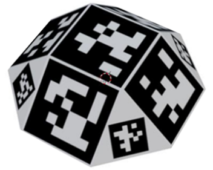
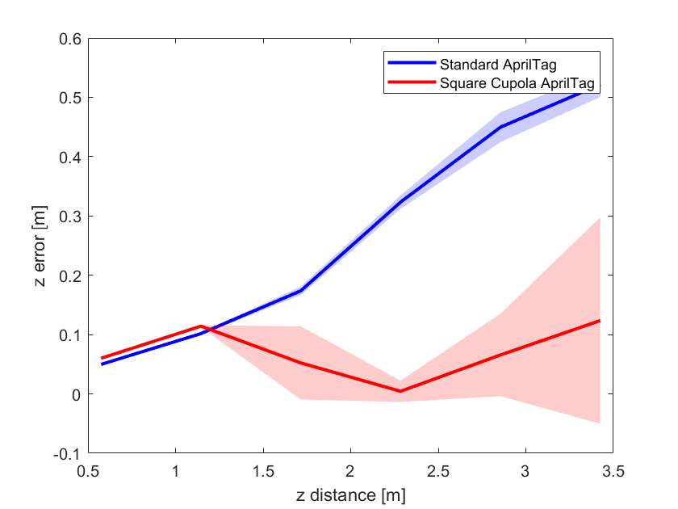
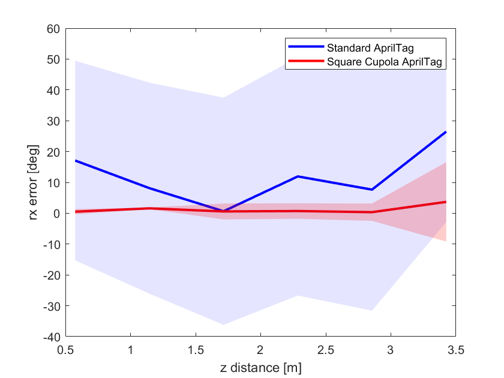
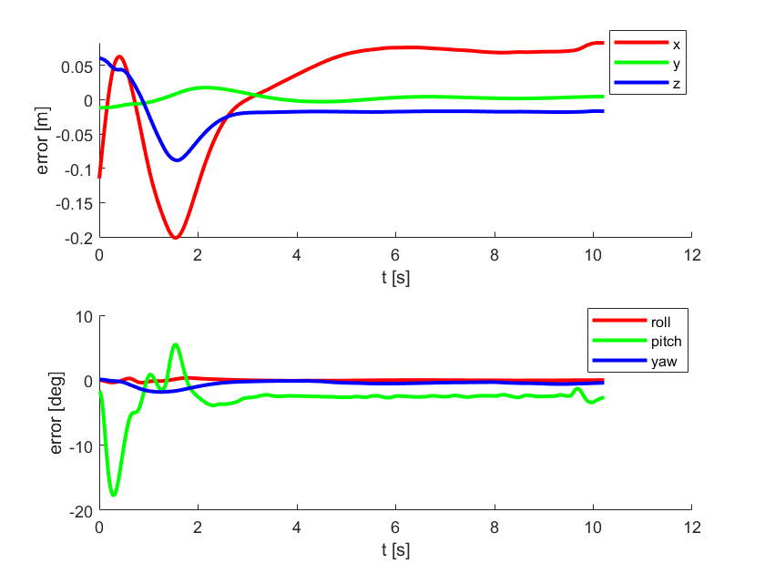
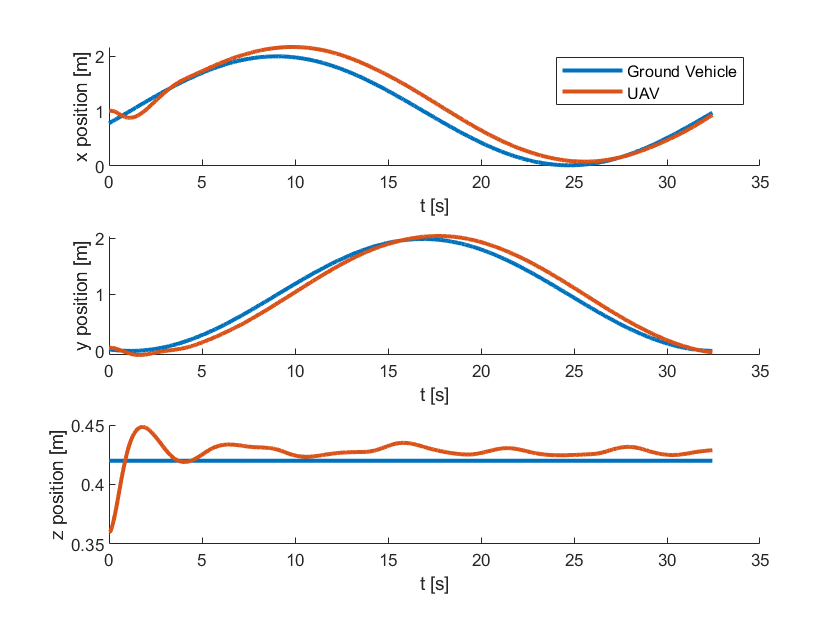
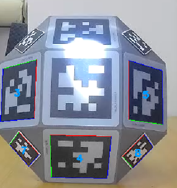

# Square Cupola AprilTag: A High-Precision Fiducial Marker

This repository contains the research outcomes for "Square Cupola AprilTag: A High-Precision Fiducial Marker for Pose Estimation Based on Accuracy Experiments of AprilTag".

## Overview

This research addresses the limitations of standard fiducial markers in precise pose estimation for Unmanned Aerial Vehicles (UAVs), particularly their restricted detection angles and suboptimal accuracy. To overcome these issues, we propose the **Square Cupola AprilTag**, a novel three-dimensional fiducial marker. Its unique structure enables detection over a broader range of angles. The core contribution is a data fusion algorithm, based on empirical accuracy experiments of the standard AprilTag, to optimally fuse pose estimations from multiple faces of the cupola. This method significantly reduces pose errors and demonstrates enhanced robustness, especially in challenging reflective environments.

## Key Results

### Improved Pose Estimation Accuracy

Compared to the standard AprilTag, our Square Cupola AprilTag, combined with the proposed data fusion algorithm, demonstrates a significant reduction in pose estimation error and variance, especially at larger distances.

As shown in the figures below, the position error in the z-axis is reduced by up to four times at a distance of 3.4 meters. The orientation estimation (rx angle) is also more stable, with consistently smaller errors and standard deviations across the tested range.

| Standard AprilTag vs. Square Cupola AprilTag |
| :---: |
|  |
| *Position error (z-axis) comparison* |
|  |
| *Orientation error (rx-axis) comparison* |

### UAV Target Tracking Performance

We validated the effectiveness of our method in simulated UAV target tracking scenarios. The UAV successfully tracks a ground vehicle moving in both uniform linear and circular motions, relying solely on visual feedback from the Square Cupola AprilTag.

**1. Uniform Linear Motion Tracking**

The UAV tracks a ground vehicle moving at a constant velocity of 0.7 m/s. The system achieves stable tracking with a position error of approximately 0.07 m.

| Linear Motion Tracking Results |
| :---: |
|  |
| *Click the image above to play the tracking video (Media/linear_tracking.mp4)* |

**2. Uniform Circular Motion Tracking**

The UAV tracks a ground vehicle moving along a circular trajectory with a radius of 1 m. Despite the more complex dynamics, the tracking is successful, with a position error consistently below 0.16 m, demonstrating the method's effectiveness.

| Circular Motion Tracking Results |
| :---: |
|  |
| *Click the image above to play the tracking video (Media/circular_tracking.mp4)* |

### Robustness in High-Reflective Environments

A key advantage of the Square Cupola AprilTag is its robustness against light reflection. In environments with strong, direct light, a standard planar AprilTag can fail due to reflective interference. However, the polyhedral geometry of our marker ensures that some of its faces remain detectable, maintaining continuous and reliable pose estimation.

| Standard AprilTag (Left) vs. Square Cupola AprilTag (Right) |
| :---: |
|  |
| *Left: Standard AprilTag fails. Right: Square Cupola AprilTag is successfully detected.* |

## Publication

This work has been accepted by the **International Conference on Aerospace System Science and Engineering 2025** and was presented orally.
